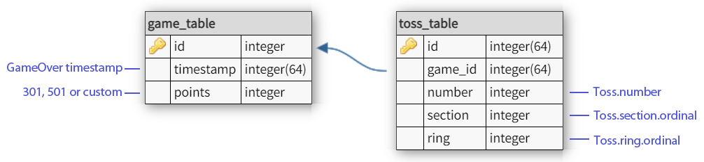

# Darts Training Calculator (Work In Progress)

The app counts scores during Darts training session.

To-do:

- добавить возможность кастомной игры (301, 501, введите своё значение (>1))
- в Настройках выбор "начинать с удвоения" (doubling in ON/OFF)
- добавить дополнительное поле в SavedGames - кол-во бросков и показывает его в History
- броски, которые не пошли в зачёт, должны отличаться (например, зачёркиваться)
- (может быть) добавить удаление бросков с конца списка
- переделать в соответствии с https://devcolibri.com/7-pro-tips-for-room/ (читать сразу связанные данные) (тогда надо создавать новую модель Игра+Броски и в History и gameDetails работать уже с ней. Это заодно решит проблему отображения количества бросков с списке игр.)
- формат даты из настроек телефона

*Database diagram:*

