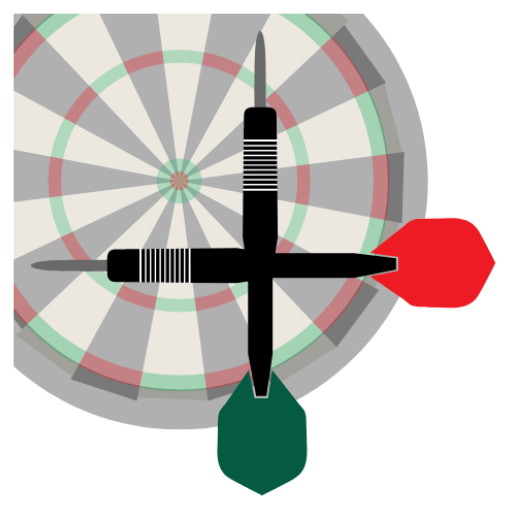
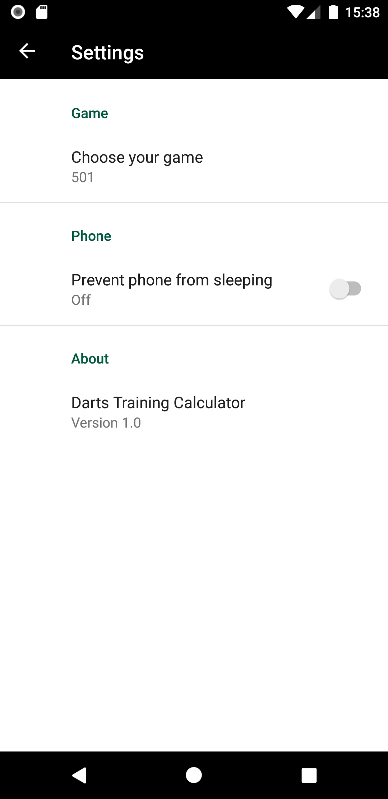
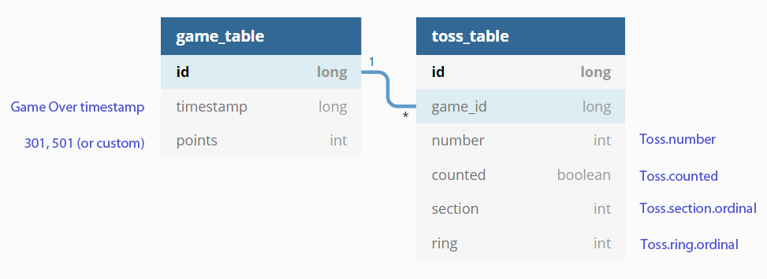

#  Darts Training Calculator

Group project with Anastasia Kantor ([GitHub](https://github.com/Anastasia-Kan) [LinkedIn](https://www.linkedin.com/in/anastasia-kantor-503563117/))

## app description

Improve your Darts skills without puzzling over mathematics!

* You train - the App takes care about the rest!
* You aim and throw - the app does all the calculations!

Score darts and track your progress, that you can always share with your friends. Application is the only tool you need while improving your skills.

Features included:

* Score games of 301 and 501
* Saving history of all your games with detailed view
* Sharing your results with friends
* Unlimited “Undo Throw” within any match
* Start a new game at any point
* No Ads
* No subscription or in-app purchase required
* App is available in either English or Russian

The more you practice the better you become! Let’s darts!  

 

## tech data

**Tags:** Kotlin, Navigation, ViewModel, LiveData, Two-way Data Binding, Room, Coroutines, Preference

*Database diagram:*

